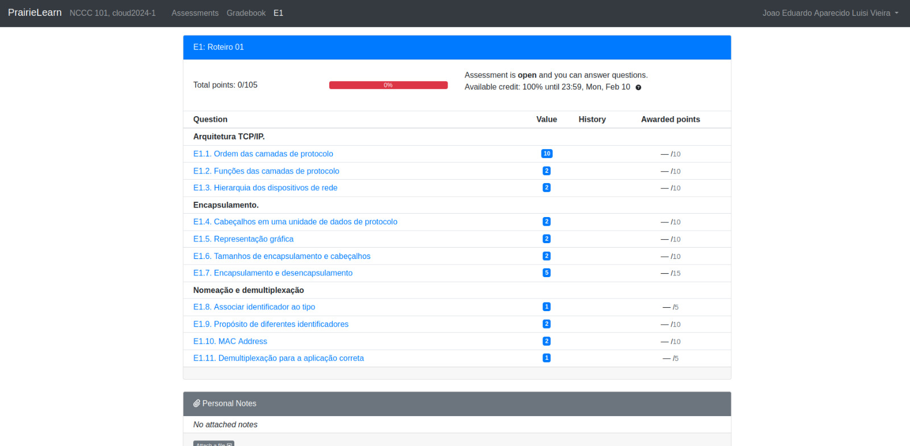

# Bare Metal - Aplicação

# **Usando a infraestrutura:** 

## Django em Nuvem Bare-Metal

### Primeiro Deploy

Vamos realizar um deploy manual de uma aplicação simples em Django em nossa nuvem MaaS.

Antes de começar, realize um pequeno ajuste no DNS server:

* Dentro da aba Subnets, clicar na subnet 172.16.0.0/20 e editar a Subnet summary colocando o DNS do Insper - 172.20.129.131

### Primeira parte: Banco de Dados

Postgres é um servidor de banco de dados versátil e de fácil manejo. Muito usado em projetos Opensource.

* Acesse o Dashboard do MaaS e realize o deploy do Ubuntu 22.04 no server1.
* Acesse o terminal do server1 via SSH:
  * ```$ sudo apt update```
  * ```$ sudo apt install postgresql postgresql-contrib -y```
* Ainda no terminal do server1, crie agora um usuário para a aplicação:
  * ```$ sudo su - postgres```
  * ```$ createuser -s cloud -W```
  * Usar a senha: cloud
* Crie um database para a aplicação:
  * ```$ createdb -O cloud tasks```
* Exponha o serviço para acesso:
  * ```$ nano /etc/postgresql/14/main/postgresql.conf```
  * Remova o comentário e substitua a string da linha para aceitar conexões remotas:
```
  listen_addresses = '*'
```
  * ```$ nano /etc/postgresql/<versão>/main/pg_hba.conf```
  * Adicione a linha que libera qualquer máquina dentro da subnet do kit:
```
  host    all             all             172.16.0.0/20          trust
```
* Saia do usuário postgres
* Libere o firewall:
  * ```$ sudo ufw allow 5432/tcp```
* Reinicie o serviço:
  * ```$ sudo systemctl restart postgresql```

!!! Tarefa-1

    Estude os comandos ping, ifconfig, systemctl, telnet, ufw, curl, wget e journalctl. Com estes comandos apresente prints das Telas  que provam que o banco de dados está:
    
        1. Funcionando e seu Status está como "Ativo" para o Sistema Operacional
        1. Acessivel na própria maquina na qual ele foi implantado.
        1. Acessivel a partir de uma conexão vinda da máquina MAIN.
        1. Em qual porta este serviço está funcionando.


### Parte II: Aplicação Django

De volta ao maas, vamos subir uma aplicação ORM Django pré produzida. No lugar de [login], utilize o usuário criado para administrar o MaaS.

* Peça uma máquina direto do cli no terminal agora:
  * ```$ maas login [login] http://172.16.0.3:5240/MAAS/```
  * Buscar o token no dashboard dentro das configurações do usuário.
* Solicite a reserva da máquina para o MaaS:
  * ```$ maas [login] machines allocate name=server2```
  * Anote o campo system_id do json resultante.
* Realize o deploy via linha de comando, usando o cli:
  * ```$ maas [login] machine deploy [system_id]```
* No SSH do server2:
  * ```$ git clone https://github.com/raulikeda/tasks.git```
  * Entre no diretorio tasks.
  * ```$ ./install.sh```
  * reboot e aguarde
* Teste acessando o serviço na porta 8080 no terminal do maas:
  * ```$ wget http://[IP server2]:8080/admin/```

Para acessar o serviço no seu browser seria necessário fazer um NAT no roteador. Porém podemos considerar utilizar um **TUNEL SSH**, com esse serviço temporário podemos expor o serviço para fora do kit enquanto o terminal que o tunnel estiver utilizando esteja ativo:

* Desconecte do SSH do maas
* Reconecte novamente usando:
  * ```$ ssh cloud@10.103.0.X -L 8001:[IP server2]:8080```
* O comando acima irá criar um tunel do serviço do server2 na porta 8080 para o seu localhost na porta 8001 usando a conexão SSH.
* Note que é importante que a porta 8001 não esteja sendo usada no seu computador.
* Acesse então o endereço no browser: http://localhost:8001/admin/
  * Login Django: cloud
  * Senha Django: cloud

Tome um tempo olhando o conteúdo do arquivo install.sh. Ele automatiza as tarefas de instalação usando shell script.

Note que a utilização do maas-cli no terminal substitui a utilização do dashboard. Tome um tempo explorando:

  * ```$ maas [login] help commands```

Caso tenha interesse na aplicação django: https://docs.djangoproject.com/pt-br/3.1/intro/tutorial01/


!!!Tarefa-2
    
    De um print das Telas abaixo:
    
        1. Do Dashboard do **MAAS** com as máquinas.
        1. Da aba images, com as imagens sincronizadas.
        1. Da Aba de cada maquina(5x) mostrando os testes de hardware e commissioning com Status "OK"
      
## Utilizando o Ansible - deploy automatizado de aplicação

!!! Tarefa-3

      1. De um print da tela do Dashboard do MAAS com as 2 Maquinas e seus respectivos IPs.
      1. De um print da aplicacao Django, provando que voce está conectado ao server 
      1. Explique como foi feita a implementacao manual da aplicacao Django e banco de dados.

Antes tinhamos 1 aplicação Django, agora teremos 2 aplicações django (server2 e server3) **compartilhando o mesmo banco de dados (server1)**.
Os motivos para fazermos isso são dois:

* Alta disponibilidade: se um node cair o outro está no ar, para que nosso cliente acesse.
* Load Balancing: podemos dividir a carga de acesso entre os nós.

Vamos realizar a instalação da mesma aplicação de forma automática, por exemplo **podemos efetuar a instalação em diversos servers**. Vamos então utilizar novos conceitos e ferramentas: Exemplo - gerenciador de deploy Ansible (<https://www.ansible.com/>)

Características:

* Idempotente no sentido de conseguir repetir todos os procedimentos sem afetar os estados intermediários da instação.
* Fácil de se lidar com um pool de máquinas simultaneamente.
* Consegue realizar o provisionamento automático de VMs e Containers (mas não metal).

Fazer agora:

* Peça o deploy no server3 para o maas via cli
* Agora no SSH do main:
  * \$ sudo apt install ansible
  * \$ wget <https://raw.githubusercontent.com/raulikeda/tasks/master/tasks-install-playbook.yaml>
  * \$ ansible-playbook tasks-install-playbook.yaml -\-extra-vars server=[IP server3]

!!! Tarefa-4

    Teste o acesso, caso esteja tudo certo, faça a tarefa abaixo
    
        1. De um print da tela do Dashboard do MAAS com as 3 Maquinas e seus respectivos IPs.
        1. De um print da aplicacao Django, provando que voce está conectado ao server2 
        1. De um print da aplicacao Django, provando que voce está conectado ao server3 
        1. Explique qual diferenca entre instalar manualmente a aplicacao Django e utilizando o Ansible.

Contudo seria ideal que tivéssemos apenas um ponto de entrada, ao invés de escolher manualmente ou chavear os IPs dos nós.

## Balancamento de carga usando Proxy Reverso

Para montar o ponto único de entrada, utilizaremos uma aplicação de proxy reverso como load balancer.

Vocês conseguem instalar o NGINX no nó server4 como loadbalancer? ... **Então monte este proxy**.

* Tutorial para fazer manual: <https://www.digitalocean.com/community/tutorials/how-to-set-up-nginx-load-balancing>

??? DICAS
    Loadbalancing é um mecanismo útil para distribuir o tráfego de entrada por vários servidores privados virtuais capazes. Ao distribuir o mecanismo de processamento por várias máquinas, a redundância é fornecida à aplicação - garantindo tolerância a falhas e maior estabilidade. O algoritmo Round Robin para balanceamento de carga envia visitantes para um conjunto de IPs. Em seu nível mais básico, o Round Robin, que é relativamente fácil de implementar, distribui a carga do servidor sem considerar fatores mais matizados como o tempo de resposta do servidor e a região geográfica dos visitantes.

    Configuração:
      Antes de configurar o loadbalancing do nginx, você deve ter o nginx instalado no seu VPS. Você pode instalá-lo rapidamente com o apt-get:

      $ sudo apt-get install nginx

    Módulo Upstream

      Para configurar um loadbalancer round robin, precisaremos usar o módulo upstream do nginx. Incorporaremos a configuração nas definições do nginx.

      Prossiga e abra a configuração do seu site (neste exemplo, trabalharei com o host virtual padrão genérico):

       $ sudo nano /etc/nginx/sites-available/default

      Precisamos adicionar a configuração de balanceamento de carga ao arquivo.

      Primeiro, precisamos incluir o módulo upstream, que se parece com isto:

       upstream backend { server backend1.exemplo.com; server backend2.exemplo.com; server backend3.exemplo.com; }

      Depois, devemos referenciar o módulo mais adiante na configuração:

       server { location / { proxy_pass http://backend; } }

      Reinicie o nginx:

       $ sudo service nginx restart

      Contanto que você tenha todos os servidores privados virtuais no lugar, agora você deve encontrar que o balanceador de carga começará a distribuir os visitantes igualmente para os servidores vinculados.

??? DICAS
    No arquivo de tasks/views.py de cada Django modifique a mensagem "Hello World ..." para conseguir identificar cada server (coloque uma mensagem diferente em cada)

      Código:

        from django.shortcuts import render

        from django.http import HttpResponse

        def index(request):
        
          return HttpResponse("Hello, world. You're at the tasks index.")


    No arquivo de urls.py customize o seu path no urlpatterns:

      urlpatterns = [path( '  ', views.index, name='index'),]

!!! Tarefa-5

    Teste o acesso, caso esteja tudo certo, faça a tarefa abaixo:

        1. De um print da tela do Dashboard do MAAS com as 4 Maquinas e seus respectivos IPs.
        1. Altere o conteúdo da mensagem contida na função `index` do arquivo `tasks/views.py` de cada server para distinguir ambos os servers. 
        1. Faça um `GET request` para o path que voce criou em urls.py para o Nginx e tire 2 prints das respostas de cada request, provando que voce está conectado ao server 4, que é o Proxy Reverso e que ele bate cada vez em um server diferente server2 e server3.  


#### Agora que você utilizou um gerenciador de deploy, vamos retormar a criação de nuvem utilizando este novo conceito.!!!!

**Remova o deploy (release) de todos nós no kit.**

## Finalizando

Entre no Site e responda as questoes da plataforma PrairieLearn, você deve fazer no minimo de 70 pontos e pedir para fazer a arguição para considerar entregue este roteiro 1.

[LINK da plataforma de questões](https://us.prairielearn.com/pl)

Acessar com seu usuário de login do INSPER. **e-mail institucional**

As imagens abaixo são da plataforma.

* Clicar em Enroll Course
* Procurar o Curso -> NCCC 101: Network concepts for cloud construction
* versão 25a-cloud
* Se cadastrar. 
* Responder as questões


{width=600}


{width=600}


{width=600}


<!-- !!! exercise
    QUESTOES-4

    1. O que é e como funciona o NAT? 
    1. O que significa LTS? Por que isso importa para uma empresa?
    1. O que é IPv6? Qual a importância da migração?
    1. A literatura preconiza que o Modelo de Rede Internet possui 4 camadas, quais são elas e quais camadas foram envolvidas nesse capítulo?
    1. A literatura mais antiga discorre sobre o Modelo de Rede OSI de 7 camadas. Explique a diferença entre os dois modelos.
    1. O que é um MAC address?
    1. O que é um IP address? Como ele difere do MAC address?
    1. O que é CIDR? Qual o papel da subrede? 
    1. O que são DHCP, DNS e gateway?
 -->

## **Conclusão:** *SOMENTE PARA PENSAR* 

```

 Descreva como o MaaS poderia ser utilizado em um datacenter real (com muitos servidores) e como seria um processo alternativo sem essa ferramenta. Ainda, é possível e *SIMPLES* realizar a implantação de uma aplicação usando o MaaS?

```
