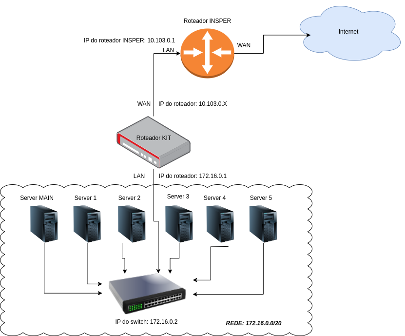
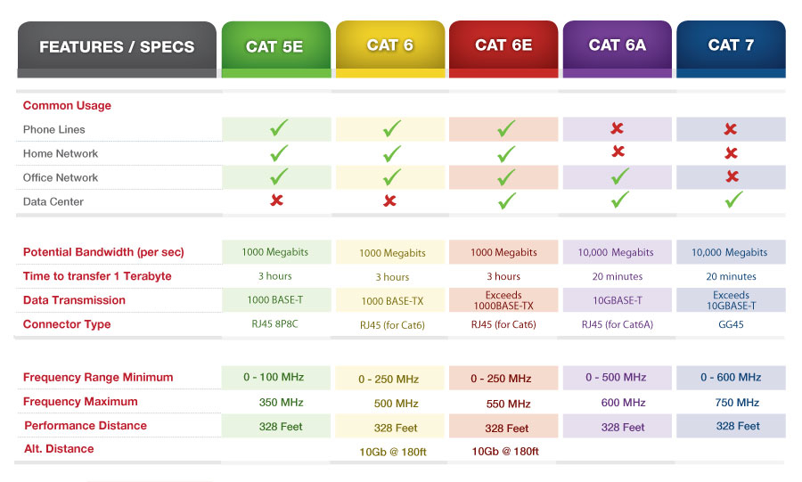
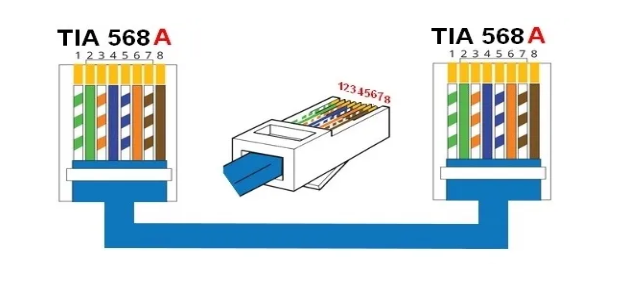
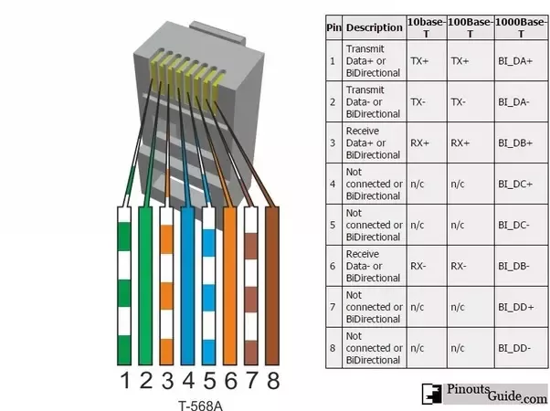
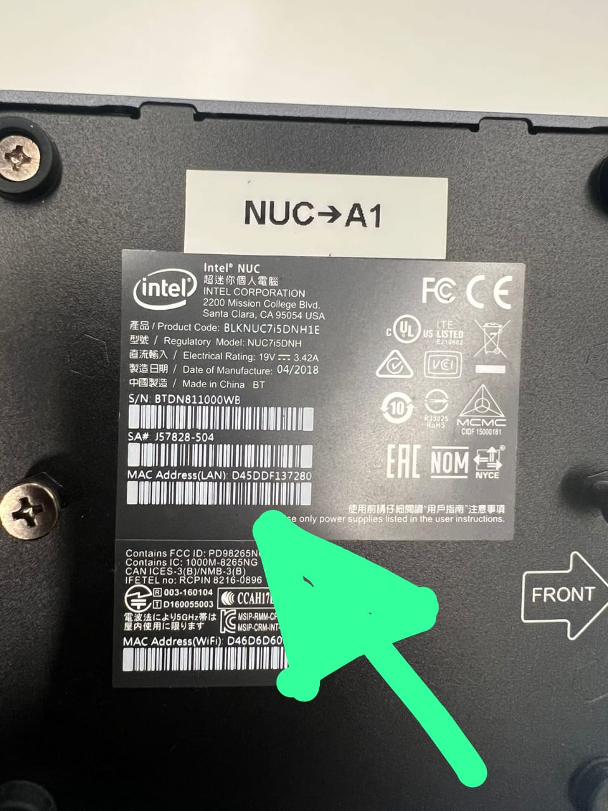
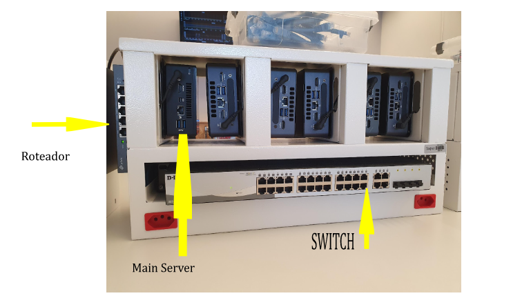

# Laboratório de Cabeamento

## Objetivos:

- Conhecer os padrões mais utilizados para o cabeamento de rede e aprender a confeccionar um cabo de rede.
- Realizar a configuração física inicial de todos os equipamentos que compõem o kit de trabalho de Cloud Computing.
- Garantir que a infraestrutura física esteja pronta para a próxima etapa: o provisionamento dos servidores via MAAS.

### Pré-requisitos:

- Leitura prévia sobre **Ethernet**, com foco nos temas:  
  [Tanenbaum - Seções 2.2.1 Par Trançado, 4.3.1 Cabeamento Ethernet, 4.3.8 Ethernet de Gigabit].

---

## Visão Geral do Kit de Cloud Computing

O seu kit contém os seguintes itens:

- 1 Roteador TP-LINK TL-R470T+
- 1 Switch DLink DSG-1210-28 de 28 portas
- 6 hosts (NUCs)

{width=600}

---

## Passo 1 – Confecção do Cabo de Rede (Patch Cord)

### Primeiro exercício:

Você irá confeccionar um cabo de rede para conectar seu notebook ao ambiente do kit.

Utilizaremos o padrão **ANSI/TIA/EIA 568**, com a categoria de cabo **Cat6**.

{width=600}

### Resumo das Categorias de Cabos Ethernet:

Um resumo das diferenças entre as categorias de cabos Ethernet:

* Categoria 4 (Cat 4):

Suporta velocidades de até 16 Mbps.
Pouco comum e geralmente substituído por cabos de categoria superior devido à sua limitada largura de banda.

* Categoria 5 (Cat 5):

Introduziu melhorias significativas na capacidade de transmissão de dados.
Suporta velocidades de até 100 Mbps (Ethernet 100BASE-TX).
Utilizado amplamente para redes Ethernet 100BASE-TX e também para redes de telefonia e vídeo.

* Categoria 5e (Cat 5e):

"E" significa "Enhanced" (Aprimorado).
Melhorias adicionais na capacidade de transmissão e redução da interferência.
Suporta velocidades de até 1 Gbps (Gigabit Ethernet) até 100 metros.

* Categoria 6 (Cat 6):

Oferece melhor desempenho e largura de banda em comparação com Cat 5e.
Suporta velocidades de até 10 Gbps em curtas distâncias (até 55 metros) e até 1 Gbps em distâncias de até 100 metros.
Categoria 6a (Cat 6a):

"A" significa "Augmented" (Aumentado).
Melhorias adicionais na capacidade de transmissão e redução da interferência em comparação com Cat 6.
Suporta velocidades de até 10 Gbps em distâncias de até 100 metros.

* Categoria 7 (Cat 7):

Introduzido para suportar o padrão 10GBASE-T.
Oferece maior largura de banda e imunidade a interferências.
Suporta velocidades de até 10 Gbps em distâncias de até 100 metros.

* Categoria 8 (Cat 8):

Projetado para atender às demandas de redes de alta velocidade, como data centers e backbone de rede.
Suporta velocidades de até 40 Gbps e 100 Gbps em curtas distâncias (até 30 metros).

---

{width=600}

### Revisão: Protocolo Ethernet

O protocolo Ethernet é um dos protocolos mais comuns e amplamente utilizados em redes de computadores. Ele define as regras para a comunicação de dados entre dispositivos em uma rede local (LAN - Local Area Network).

Aqui estão alguns pontos-chave sobre o protocolo Ethernet:

Meio de Transmissão: O Ethernet pode ser usado em diferentes tipos de mídia de transmissão, incluindo cabos de cobre (como o Ethernet de par trançado) e fibra óptica. Isso proporciona flexibilidade na implementação de redes Ethernet em diversos ambientes.

Quadro Ethernet: Os dados são transmitidos em unidades chamadas de "quadros Ethernet". Cada quadro possui um cabeçalho e um trailer, além dos dados propriamente ditos. O cabeçalho contém informações importantes, como endereços MAC de origem e destino, tipo de protocolo e verificação de erros.

Endereços MAC: Cada dispositivo em uma rede Ethernet possui um endereço MAC (Media Access Control) único, que é gravado na placa de rede do dispositivo. Esses endereços são utilizados para identificar os dispositivos na rede e determinar para qual dispositivo os quadros Ethernet são destinados.

Acesso ao Meio: O protocolo Ethernet utiliza um método de acesso ao meio chamado CSMA/CD (Carrier Sense Multiple Access with Collision Detection). Isso significa que os dispositivos verificam o meio de transmissão para detectar a presença de sinais de outros dispositivos antes de iniciar a transmissão. Se ocorrer uma colisão (ou seja, dois dispositivos tentam transmitir simultaneamente), o CSMA/CD é usado para lidar com a situação e tentar retransmitir os dados de forma eficiente.

Padrões Ethernet: O Ethernet evoluiu ao longo do tempo, com diferentes padrões que especificam velocidades de transmissão de dados, tipos de cabos, e outras características. Alguns dos padrões mais comuns incluem Ethernet de 10 Mbps (10BASE-T), Fast Ethernet de 100 Mbps (100BASE-TX), Gigabit Ethernet de 1 Gbps (1000BASE-T), e 10 Gigabit Ethernet de 10 Gbps (10GBASE-T).

{width=600}

---

## Lapidando o Projeto

### Antes de iniciar a próxima etapa:

**É obrigatório fazer o "reset" do switch e do roteador do seu kit!**

Agora, utilizando o cabo que você confeccionou:

- Conecte seu notebook aos equipamentos (roteador e switch) para configura-los.

### Configuração inicial do roteador:

- Usuário: `admin`
- Senha: `cloud26` + letra do kit (exemplo: Kit G → senha: `cloud26g`)
- Altere a rede LAN:  
O IP do roteador deve ser configurado como `172.16.0.1/20`.  
A partir deste momento, o DHCP do roteador começará a distribuir IPs na faixa `172.16.0.0/20`.

### Configuração inicial do switch:

- IP do switch: `172.16.0.2/20`.

---

## Passo 2 – Anotação dos MAC Addresses das NUCs

Na parte inferior de cada NUC, localize e **anote o MAC Address** de todas as máquinas.  
Você precisará dessas informações durante a configuração do MAAS.

{width=350}

Identificação dos hosts (da esquerda para a direita):

- main (não é necessário pegar MAC_Address)
- server1
- server2
- server3
- server4
- server5

---

## Passo 3 – Conexão Física dos Hosts ao Switch e Roteador

{width=600}

Com base na imagem de topologia (primeira imagem deste roteiro):

- Conecte os cabos de rede (pegar os cabos na caixa verde ao fundo do lab) no kit entre:
  - Switch
  - Hosts (NUCs)
  - Roteador

---

## Conclusão desta Etapa:

Com o cabeamento pronto e os dispositivos configurados, sua infraestrutura física está finalizada.  
Agora você está pronto para seguir para o próximo passo:  
**Instalar e configurar o MAAS**, que fará o provisionamento automático dos servidores bare-metal do seu kit.

👉 Continue para a seção **Infraestrutura - MAAS** no Roteiro 1.
