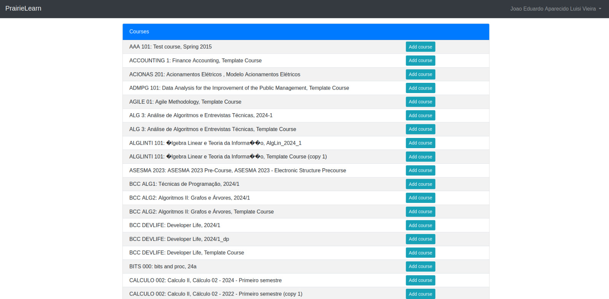
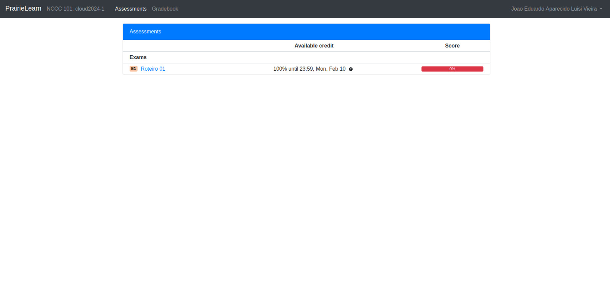
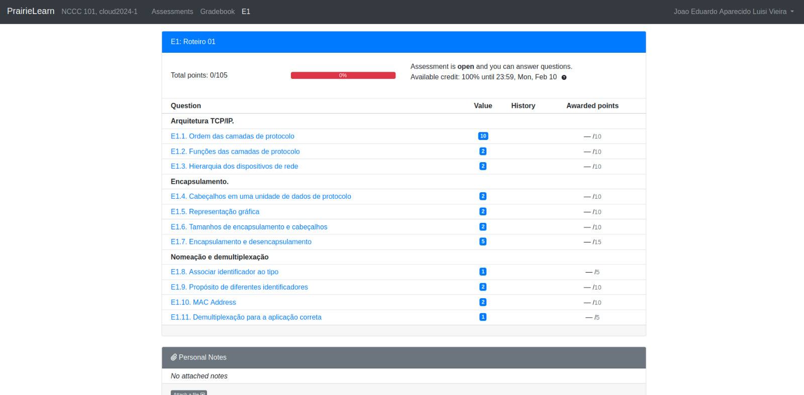

# Bare Metal

## Objetivos do Roteiro 1:

* Compreender os conceitos fundamentais de uma plataforma de gerenciamento de hardware bare-metal.
* Introduzir os princípios básicos de redes de computadores aplicados ao ambiente de laboratório.
* Preparar e padronizar a infraestrutura física antes da configuração lógica dos servidores.

### Pré-requisitos:

* Realizar a leitura introdutória sobre o MaaS: [https://maas.io/](https://maas.io/).

??? info
    **DIVISÃO DO ROTEIRO 1**
    
    Este roteiro está organizado em três partes sequenciais:
    
    1. **Preparação da Infraestrutura Física (Cabeamento e Rede)**  
       Organização dos dispositivos, cabeamento estruturado e configuração inicial do roteador e switch.
    
    2. **Criação da Infraestrutura Lógica (Nuvem Bare-Metal)**  
       Instalação e configuração do MaaS para provisionamento dos servidores físicos.
    
    3. **Uso da Infraestrutura: Deploy de uma Aplicação Django**  
       Instalação e execução de uma aplicação web para validar o funcionamento da infraestrutura criada.

## Material Disponível

Cada grupo terá acesso ao seguinte kit de equipamentos:

  * 1 NUC (main) com 10 GB de RAM e 1 SSD (120 GB)
  * 1 NUC (server1) com 12 GB de RAM e 1 SSD (120 GB)
  * 1 NUC (server2) com 16 GB de RAM e 2 SSDs (120 GB + 120 GB)
  * 3 NUCs (server3, server4 e server5) com 32 GB de RAM e 2 SSDs (120 GB + 120 GB cada)
  * 1 Switch D-Link DSG-1210-28 (28 portas)
  * 1 Roteador TP-Link TL-R470T+

### Rede

Cada grupo contará com um ponto de rede (cabo preto) conectado à infraestrutura interna da faculdade.

Além disso, cada kit possui um IP de entrada específico.  
**Consulte o dashboard do seu roteador para verificar os endereços disponíveis.**

**Importante:** Atente-se às modificações e configurações necessárias, conforme indicado nos requisitos de projeto descritos nas próximas etapas.

### Senhas - Padrão de Segurança

**Todas as senhas criadas durante o projeto devem seguir este padrão:**

  * Utilize o formato: `cloud26` + letra do kit em minúsculo.
  * Exemplo: Para o kit "Z", a senha será: `cloud26z`.
  * Esta senha deve ser usada **em todos os serviços e equipamentos** configurados durante o roteiro.
  * **Nunca altere senhas pré-configuradas nos dispositivos do kit.**

### ⚡ Tarefa Inicial: Configuração Física da Infraestrutura

Antes de iniciar as atividades de instalação lógica (MAAS), você deverá realizar a montagem física e padronização do seu kit.

👉 Para isso, acesse agora a seção **Cabeamento**, onde estão as instruções detalhadas sobre:  
- Organização dos cabos  
- Ligação dos dispositivos  
- Configuração básica do roteador e do switch  

Antes de iniciar os Roteiros, faça o cadastro do seu usuário na plataforma de teoria e acompanhamento de suas atividades ao longo do semestre.

## Prairie Learn da disciplina!!!

Entre no Site e responda as questoes da plataforma PrairieLearn.

[LINK da plataforma de questões](https://us.prairielearn.com/pl/course_instance/183202)

Acessar com seu usuário de login do INSPER. **e-mail institucional**

As imagens abaixo são da plataforma.

* Clicar em Enroll Course
* Procurar o Curso -> CLOUD 101: Computação em nuvem INSPER
* versão CompNuvem-2026a
* Se cadastrar. 
* Responder as questões

{width=600}

{width=600}

{width=600}

