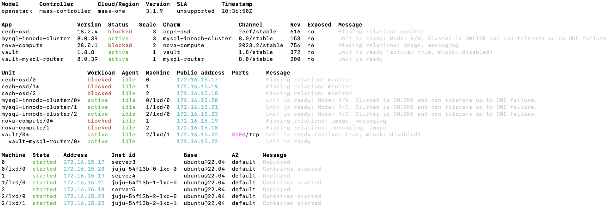

## Criando a Infraestrutura (Nuvem VM) - Servidor Virtual Privado (VPS)

Nesse roteiro vamos instalar um conjunto de aplicações denominado **Openstack** que vai permitir distribuirmos *virtual machines* usando os nós disponíveis no kit.

Até o momento usamos o **MAAS** para orquestrar o *bare metal* e o **juju** para cuidar do *deployment* de aplicações (exemplo grafana e prometheus). Agora, vamos utilizar o **Openstack** para criar VMs e distribuir os serviços em todas as máquinas kit com maior eficiência.
<!-- 
### Instalando - Openstack Canonical Distro

* Faça o *download* do charm **Openstack Base** no maas:
  *  ` ``$ charm pull cs:openstack-base` ``
* Dentro do diretório criado, edite o arquivo *bundle.yaml*:

  * *identifique* quantas máquinas serão alocadas.
  * *verifique* cada um dos serviços que serão instalados e em quais máquinas.
  * sete o nome do adaptador de rede, *br-ex:eth1* na variável *data-port*. **Cuidado para não errar** 

`` `
variables:
  openstack-origin:    &openstack-origin     cloud:focal-yoga
  data-port:           &data-port            br-ex:eth1
  worker-multiplier:   &worker-multiplier    0.25
  osd-devices:         &osd-devices          /dev/sdb /dev/vdb
  expected-osd-count:  &expected-osd-count   3
  expected-mon-count:  &expected-mon-count   3
` ``
**Ainda no bundle altere a configuracao do software NTP e deixe conforme abaixo:**
`` `
  ntp:
    annotations:
      gui-x: '315'
      gui-y: '1030'
    charm: ch:ntp
    num_units: 0
` `` -->
<!-- 
* Reservar (Allocate) a máquina "server2" no maas.
* Instale o bundle customizado:
  * ```$ juju deploy ./bundle.yaml```
* Hora da leitura na documentacao [LINK][https://docs.openstack.org/project-deploy-guide/charm-deployment-guide/latest/] :book: :book: :book: -->

!!! warning "Atenção"

    **Confira se os seus recursos fisicos seguem, no MÍNIMO, a tabela abaixo, volte ao dashboard do MAAS e crie as Tags conforme descrito:**

    | Node name   | Tag(s)    | CPUs | NICs | RAM  | Disks | Storage |
    |-------------|-----------|:----:|:----:|-----:|:-----:|---------|
    | node1.maas  | controller| 2    | 1    | 12.0 | 1     | 80.0    |
    | node2.maas  | reserva   | 2    | 1    | 24.0 | 1     | 80.0    |
    | node3.maas  | compute   | 2    | 1    | 32.0 | 1     | 80.0    |
    | node4.maas  | compute   | 2    | 1    | 32.0 | 1     | 80.0    |
    | node4.maas  | compute   | 2    | 1    | 32.0 | 1     | 80.0    |

    **Antes de começar a instalação do Openstack, verifique se o MAAS está configurado corretamente (Brigdes, Subnets, Tags, etc).**


### Implantação do OpenStack:

* "Siga" o passo a passo do Link abaixo, porém **não** instale nada no server2 que deve estar reservado(alocado), **altere os comandos** que forem necessários para utilizar o Node server 1 como **controller**, o node server 2 como **Reserva** e os nodes server 3,4 e 5 como **compute** (onde o Openstack será instalado).
* **Rode 1 comando por vez tenha CALMA!!!**
* **Siga o status para ver se a implantação está correndo como o esperado:** `juju status`
* **Aguarde a instalação terminar, só vá para o próximo passo quando tiver certeza que o comando anterior foi finalizado**
* Esse roteiro é baseado na documentação oficial do Openstack, porém adaptado para o nosso ambiente. Logo, **atente** para o número de máquinas que você tem disponível e para a configuração de rede que você fez no MAAS.
* Documentação oficial: [Implantação do OpenStack](https://docs.openstack.org/project-deploy-guide/charm-deployment-guide/latest/install-openstack.html#openstack-release){target=_blank}. Estude esse link antes de começar a instalação, busque entender o que está sendo feito a cada passo.

!!! warning "Juju Controller"

    O Juju necessita de uma máquina exclusiva para controlar todo o deploy e máquina é alocada automaticamente durante o bootstrap e controlará todo o deploy. Em nosso ambiente, o Juju Controller será instalado no server1.
    Logo, **SE** você ainda **NÃO TEM** um controlador Juju instalado, então, precisa fazer o bootstrap de um novo controlador no server1. 

!!! tip "Monitoramento"

    Para monitorar o status da instalação do Openstack, você pode usar o comando abaixo:

    ``` {.bash .copyable .numberLines startFrom="1"}
    watch -n 2 --color "juju status --color"
    ```

    Para isso, abra um novo terminal e rode o comando acima. Ele irá atualizar a cada 2 segundos o status da instalação.


## Roteiro Atualizado de Instalação do Openstack

Esse roteiro está atualizado da documentação oficial, porém, em caso de problemas, **consulte a documentação oficial antes mesmo de pedir ajuda**, pois lá irá conter a solução para a maioria dos problemas.

### 1. Instalando o Juju Controller

!!! danger "Atenção"

    **Apenas se ainda não tiver um Juju Controller**

Adicionar a **tag** *`controller`* na máquina `server1`:
``` {.bash .copyable .numberLines startFrom="1"}
juju bootstrap --bootstrap-series=jammy --constraints tags=controller maas-one maas-controller
```

### 2. Definindo o modelo de deploy

``` {.bash .copyable .numberLines startFrom="1"}
juju add-model --config default-series=jammy openstack
```

``` {.bash .copyable .numberLines startFrom="1"}
juju switch maas-controller:openstack
```

Opcional:

Instalar o juju-dashboard:
[https://canonical-juju.readthedocs-hosted.com/en/latest/user/howto/manage-the-juju-dashboard/#manage-the-juju-dashboard](https://canonical-juju.readthedocs-hosted.com/en/latest/user/howto/manage-the-juju-dashboard/#manage-the-juju-dashboard){target=_blank}

### 3. Ceph OSD

The ceph-osd application is deployed to three nodes with the [ceph-osd](https://charmhub.io/ceph-osd){target=_blank} charm.

The names of the block devices backing the OSDs is dependent upon the hardware on the MAAS nodes. All possible devices (across all the nodes) that are to be used for Ceph storage should be included in the value for the **osd-devices** option (space-separated). Here, we’ll be using the same devices on each node: **/dev/sda**, and **/dev/sdb**. File **ceph-osd.yaml** contains the configuration:


``` {.yaml .copyable .numberLines startFrom="1" title="ceph-osd.yaml"}
ceph-osd:
  osd-devices: /dev/sda /dev/sdb
```

To deploy the application we’ll make use of the ‘compute’ tag that we placed on each of these nodes on the [Install MAAS](https://docs.openstack.org/project-deploy-guide/charm-deployment-guide/latest/install-maas.html){target=_blank} page. The command to deploy the ceph-osd application is:

``` {.bash .copyable .numberLines startFrom="1"}
juju deploy -n 3 --channel quincy/stable --config ceph-osd.yaml --constraints tags=compute ceph-osd
```

**Note:** The **-n 3** option specifies that three units of the ceph-osd application should be deployed.

If a message from a ceph-osd unit like “Non-pristine devices detected” appears in the output of **juju status** you will need to use actions **zap-disk** and **add-disk** that come with the ceph-osd charm. The **zap-disk** action is destructive in nature. Only use it if you want to purge the disk of all data and signatures for use by Ceph.

> Note
> 
> Since ceph-osd was deployed on four nodes and there are only four nodes available in this environment, the usage of the ‘compute’ tag is not strictly necessary. A tag can help if there are a surplus of nodes however.

### 4. Nova Compute

Nova is the OpenStack project that provides a way to provision compute instances (aka virtual servers). The nova-compute charm is deployed to the compute nodes with the [nova-compute](https://charmhub.io/nova-compute){target=_blank} charm. File **nova-compute.yaml** contains the configuration:

``` {.yaml .copyable .numberLines startFrom="1" title="nova-compute.yaml"}
nova-compute:
  config-flags: default_ephemeral_format=ext4
  enable-live-migration: true
  enable-resize: true
  migration-auth-type: ssh
  virt-type: qemu
```

The nodes must be targeted by machine ID since there are no more free Juju machines (MAAS nodes) available. This means we’re placing multiple services on our nodes. We’ve chosen machines 0, 1, and 2. To deploy:

``` {.bash .copyable .numberLines startFrom="1"}
juju deploy -n 3 --to 0,1,2 --channel yoga/stable --config nova-compute.yaml nova-compute
```

> Note
> 
> The ‘nova-compute’ charm is designed to support one image format type per application at any given time. Changing format (see charm option **libvirt-image-backend**) while existing instances are using the prior format will require manual image conversion for each instance. See bug [LP #1826888](https://bugs.launchpad.net/charm-deployment-guide/+bug/1826888){target=_blank}.


### 5. MySQL InnoDB Cluster

MySQL InnoDB Cluster always requires at least three database units. The mysql-innodb-cluster application is deployed to three nodes with the [mysql-innodb-cluster](https://charmhub.io/mysql-innodb-cluster){target=_blank} charm. They will be containerised on machines 0, 1, and 2. To deploy:

``` {.bash .copyable .numberLines startFrom="1"}
juju deploy -n 3 --to lxd:0,lxd:1,lxd:2 --channel 8.0/stable mysql-innodb-cluster
```

### 6. Vault

Vault is necessary for managing the TLS certificates that will enable encrypted communication between cloud applications. The vault application will be containerised on machine 2 with the [vault](https://charmhub.io/vault){target=_blank} charm. To deploy:

``` {.bash .copyable .numberLines startFrom="1"}
juju deploy --to lxd:2 vault --channel 1.8/stable
```

This is the first application to be joined with the cloud database that was set up in the previous section. The process is:

1. create an application-specific instance of [mysql-router](https://charmhub.io/mysql-router){target=_blank} with the mysql-router subordinate charm;

2. add a relation between the mysql-router instance and the database;

3. add a relation between the mysql-router instance and the application.

The combination of steps 2 and 3 joins the application to the cloud database.

Here are the corresponding commands for Vault:

``` {.bash .copyable .numberLines startFrom="1"}
juju deploy --channel 8.0/stable mysql-router vault-mysql-router
juju integrate vault-mysql-router:db-router mysql-innodb-cluster:db-router
juju integrate vault-mysql-router:shared-db vault:shared-db
```

!!! info "Unseal"

    Vault **must** now be **initialised and unsealed**. The vault charm will also need to be authorised to carry out certain tasks. These steps are covered in the [vault charm documentation](https://opendev.org/openstack/charm-vault/src/branch/stable/1.8/src/README.md#post-deployment-tasks){target=_blank}. Perform them **NOW**.


!!! info "CA Certificate (Self-signed)"

    Provide Vault with a CA certificate, we need to generate a **self-signed** CA certificate, so it can issue certificates to cloud API services. This is covered on the [Managing TLS certificates](https://docs.openstack.org/charm-guide/latest/admin/security/tls.html#add-ca-certificate){target=_blank} page. Do this now.

    ``` {.bash .copyable .numberLines startFrom="1"}
    juju run vault/leader generate-root-ca
    ```

Cloud applications are TLS-enabled via the **vault:certificates** relation. Below we start with the cloud database. Although the latter has a self-signed certificate, it is recommended to use the one signed by Vault’s CA:
  
``` {.bash .copyable .numberLines startFrom="1"}
juju integrate mysql-innodb-cluster:certificates vault:certificates
```

---

Once the above is completed the Unit section output to command **juju status** should look similar to this:



---

### 7. Neutron Networking

Neutron networking is implemented with four applications:

* neutron-api
* neutron-api-plugin-ovn (subordinate)
* ovn-central
* ovn-chassis (subordinate)

File **neutron.yaml** contains the configuration necessary (only two of them require configuration):

``` {.yaml .copyable .numberLines startFrom="1" title="neutron.yaml"}
ovn-chassis:
  bridge-interface-mappings: br-ex:eth0
  ovn-bridge-mappings: physnet1:br-ex
neutron-api:
  neutron-security-groups: true
  flat-network-providers: physnet1
```

The bridge-interface-mappings setting impacts the OVN Chassis and refers to a mapping of OVS bridge to network interface. As described in the [Create OVS bridge](https://docs.openstack.org/project-deploy-guide/charm-deployment-guide/latest/install-maas.html#ovs-bridge){target=_blank} section on the [Install MAAS](https://docs.openstack.org/project-deploy-guide/charm-deployment-guide/latest/install-maas.html){target=_blank} page, for this example it is ‘br-ex:enp1s0’.

> Note
>
> To use hardware addresses (as opposed to an interface name common to all three nodes) the bridge-interface-mappings option can be expressed in this way (substitute in your own values):

``` {.yaml .copyable .numberLines startFrom="1" title="neutron.yaml"}
bridge-interface-mappings: >-
  br-ex:52:54:00:03:01:02
  br-ex:52:54:00:03:01:03
  br-ex:52:54:00:03:01:04
```

The **flat-network-providers** setting enables the Neutron flat network provider used in this example scenario and gives it the name of ‘physnet1’. The flat network provider and its name will be referenced when we [Set up public networking](https://docs.openstack.org/project-deploy-guide/charm-deployment-guide/latest/configure-openstack.html#public-networking){target=_blank} on the next page.

The **ovn-bridge-mappings** setting maps the data-port interface to the flat network provider.

The main OVN application is ovn-central and it requires at least three units. They will be containerised on machines 0, 1, and 2 with the [ovn-central](https://charmhub.io/ovn-central){target=_blank} charm. To deploy:

``` {.bash .copyable .numberLines startFrom="1"}
juju deploy -n 3 --to lxd:0,lxd:1,lxd:2 --channel 22.03/stable ovn-central
```

The neutron-api application will be containerised on machine 1 with the [neutron-api](https://charmhub.io/neutron-api){target=_blank} charm:

``` {.bash .copyable .numberLines startFrom="1"}
juju deploy --to lxd:1 --channel yoga/stable --config neutron.yaml neutron-api
```

Deploy the subordinate charm applications with the [neutron-api-plugin-ovn](https://charmhub.io/neutron-api-plugin-ovn){target=_blank} and [ovn-chassis](https://charmhub.io/ovn-chassis){target=_blank} charms:

``` {.bash .copyable .numberLines startFrom="1"}
juju deploy --channel yoga/stable neutron-api-plugin-ovn
juju deploy --channel 22.03/stable --config neutron.yaml ovn-chassis
```

Add the necessary relations:

``` {.bash .copyable .numberLines startFrom="1"}
juju integrate neutron-api-plugin-ovn:neutron-plugin neutron-api:neutron-plugin-api-subordinate
juju integrate neutron-api-plugin-ovn:ovsdb-cms ovn-central:ovsdb-cms
juju integrate ovn-chassis:ovsdb ovn-central:ovsdb
juju integrate ovn-chassis:nova-compute nova-compute:neutron-plugin
juju integrate neutron-api:certificates vault:certificates
juju integrate neutron-api-plugin-ovn:certificates vault:certificates
juju integrate ovn-central:certificates vault:certificates
juju integrate ovn-chassis:certificates vault:certificates
```

Join neutron-api to the cloud database:
  
``` {.bash .copyable .numberLines startFrom="1"}
juju deploy --channel 8.0/stable mysql-router neutron-api-mysql-router
juju integrate neutron-api-mysql-router:db-router mysql-innodb-cluster:db-router
juju integrate neutron-api-mysql-router:shared-db neutron-api:shared-db
```

### 8. Keystone

The keystone application will be containerised on machine 0 with the [keystone](https://charmhub.io/keystone){target=_blank} charm. To deploy:

``` {.bash .copyable .numberLines startFrom="1"}
juju deploy --to lxd:0 --channel yoga/stable keystone
```

Join keystone to the cloud database:

``` {.bash .copyable .numberLines startFrom="1"}
juju deploy --channel 8.0/stable mysql-router keystone-mysql-router
juju integrate keystone-mysql-router:db-router mysql-innodb-cluster:db-router
juju integrate keystone-mysql-router:shared-db keystone:shared-db
```

Two additional relations can be added at this time:

``` {.bash .copyable .numberLines startFrom="1"}
juju integrate keystone:identity-service neutron-api:identity-service
juju integrate keystone:certificates vault:certificates
```

### 9. RabbitMQ

The rabbitmq-server application will be containerised on machine 2 with the [rabbitmq-server](https://charmhub.io/rabbitmq-server){target=_blank} charm. To deploy:

``` {.bash .copyable .numberLines startFrom="1"}
juju deploy --to lxd:2 --channel 3.9/stable rabbitmq-server
```

Two relations can be added at this time:

``` {.bash .copyable .numberLines startFrom="1"}
juju integrate rabbitmq-server:amqp neutron-api:amqp
juju integrate rabbitmq-server:amqp nova-compute:amqp
```

---

At this time the Unit section output to command juju status should look similar to this:


---

### 10. Nova Cloud Controller

The nova-cloud-controller application, which includes nova-scheduler, nova-api, and nova-conductor services, will be containerised on machine 2 with the [nova-cloud-controller](https://charmhub.io/nova-cloud-controller){target=_blank} charm. File **ncc.yaml** contains the configuration:

``` {.yaml .copyable .numberLines startFrom="1" title="ncc.yaml"}
nova-cloud-controller:
  network-manager: Neutron
```

To deploy:

``` {.bash .copyable .numberLines startFrom="1"}
juju deploy --to lxd:2 --channel yoga/stable --config ncc.yaml nova-cloud-controller
```

Join nova-cloud-controller to the cloud database:

``` {.bash .copyable .numberLines startFrom="1"}
juju deploy --channel 8.0/stable mysql-router ncc-mysql-router
juju integrate ncc-mysql-router:db-router mysql-innodb-cluster:db-router
juju integrate ncc-mysql-router:shared-db nova-cloud-controller:shared-db
```

> Note
> 
> To keep juju status output compact the expected **nova-cloud-controller-mysql-router** application name has been shortened to **ncc-mysql-router**.

Five additional relations can be added at this time:

``` {.bash .copyable .numberLines startFrom="1"}
juju integrate nova-cloud-controller:identity-service keystone:identity-service
juju integrate nova-cloud-controller:amqp rabbitmq-server:amqp
juju integrate nova-cloud-controller:neutron-api neutron-api:neutron-api
juju integrate nova-cloud-controller:cloud-compute nova-compute:cloud-compute
juju integrate nova-cloud-controller:certificates vault:certificates
```

### 11. Placement


The placement application will be containerised on machine 2 with the [placement](https://charmhub.io/placement){target=_blank} charm. To deploy:

``` {.bash .copyable .numberLines startFrom="1"}
juju deploy --to lxd:2 --channel yoga/stable placement
```

Join placement to the cloud database:

``` {.bash .copyable .numberLines startFrom="1"}
juju deploy --channel 8.0/stable mysql-router placement-mysql-router
juju integrate placement-mysql-router:db-router mysql-innodb-cluster:db-router
juju integrate placement-mysql-router:shared-db placement:shared-db
```

Three additional relations can be added at this time:

``` {.bash .copyable .numberLines startFrom="1"}
juju integrate placement:identity-service keystone:identity-service
juju integrate placement:placement nova-cloud-controller:placement
juju integrate placement:certificates vault:certificates
```


### 12. Horizon - OpenStack Dashboard

The openstack-dashboard application (Horizon) will be containerised on machine 2 with the [openstack-dashboard](https://charmhub.io/openstack-dashboard){target=_blank} charm. To deploy:

``` {.bash .copyable .numberLines startFrom="1"}
juju deploy --to lxd:2 --channel yoga/stable openstack-dashboard
```

Join openstack-dashboard to the cloud database:

``` {.bash .copyable .numberLines startFrom="1"}
juju deploy --channel 8.0/stable mysql-router dashboard-mysql-router
juju integrate dashboard-mysql-router:db-router mysql-innodb-cluster:db-router
juju integrate dashboard-mysql-router:shared-db openstack-dashboard:shared-db
```

> Note
> 
> To keep **juju status** output compact the expected **openstack-dashboard-mysql-router** application name has been shortened to **dashboard-mysql-router**.

Two additional relations can be added at this time:

``` {.bash .copyable .numberLines startFrom="1"}
juju integrate openstack-dashboard:identity-service keystone:identity-service
juju integrate openstack-dashboard:certificates vault:certificates
```

### 13. Glance

The glance application will be containerised on machine 2 with the [glance](https://charmhub.io/glance){target=_blank} charm. To deploy:

``` {.bash .copyable .numberLines startFrom="1"}
juju deploy --to lxd:2 --channel yoga/stable glance
```

Join glance to the cloud database:

``` {.bash .copyable .numberLines startFrom="1"}
juju deploy --channel 8.0/stable mysql-router glance-mysql-router
juju integrate glance-mysql-router:db-router mysql-innodb-cluster:db-router
juju integrate glance-mysql-router:shared-db glance:shared-db
```

Four additional relations can be added at this time:

``` {.bash .copyable .numberLines startFrom="1"}
juju integrate glance:image-service nova-cloud-controller:image-service
juju integrate glance:image-service nova-compute:image-service
juju integrate glance:identity-service keystone:identity-service
juju integrate glance:certificates vault:certificates
```

---

At this time the Unit section output to command **juju status** should look similar to this:


---

### 14. Ceph Monitor

The ceph-mon application will be containerised on machines 0, 1, and 2 with the [ceph-mon](https://charmhub.io/ceph-mon){target=_blank} charm. File **ceph-mon.yaml** contains the configuration:

``` {.yaml .copyable .numberLines startFrom="1" title="ceph-mon.yaml"}
ceph-mon:
  expected-osd-count: 3
  expected-mon-count: 3
```

The above informs the MON cluster that it is comprised of three nodes and that it should expect at least three OSDs (disks).

To deploy:

``` {.bash .copyable .numberLines startFrom="1"}
juju deploy -n 3 --to lxd:0,lxd:1,lxd:2 --channel quincy/stable --config ceph-mon.yaml ceph-mon
```

Three relations can be added at this time:

``` {.bash .copyable .numberLines startFrom="1"}
juju integrate ceph-mon:osd ceph-osd:mon
juju integrate ceph-mon:client nova-compute:ceph
juju integrate ceph-mon:client glance:ceph
```

For the above relations,

* The **nova-compute:ceph** relation makes Ceph the storage backend for Nova non-bootable disk images. The nova-compute charm option **libvirt-image-backend** must be set to ‘rbd’ for this to take effect.

* The **glance:ceph** relation makes Ceph the storage backend for Glance.

### 15. Cinder

The cinder application will be containerised on machine 1 with the [cinder](https://charmhub.io/cinder){target=_blank} charm. File **cinder.yaml** contains the configuration:

``` {.yaml .copyable .numberLines startFrom="1" title="cinder.yaml"}
cinder:
  block-device: None
  glance-api-version: 2
```

The **block-device** setting is set to ‘None’ to indicate that the charm should not manage block devices. The **glance-api-version** setting is set to ‘2’ to indicate that the Glance API version 2 should be used.

To deploy:

``` {.bash .copyable .numberLines startFrom="1"}
juju deploy --to lxd:1 --channel yoga/stable --config cinder.yaml cinder
```

Join cinder to the cloud database:

``` {.bash .copyable .numberLines startFrom="1"}
juju deploy --channel 8.0/stable mysql-router cinder-mysql-router
juju integrate cinder-mysql-router:db-router mysql-innodb-cluster:db-router
juju integrate cinder-mysql-router:shared-db cinder:shared-db
```

Five additional relations can be added at this time:

``` {.bash .copyable .numberLines startFrom="1"}
juju integrate cinder:cinder-volume-service nova-cloud-controller:cinder-volume-service
juju integrate cinder:identity-service keystone:identity-service
juju integrate cinder:amqp rabbitmq-server:amqp
juju integrate cinder:image-service glance:image-service
juju integrate cinder:certificates vault:certificates
```

The above **glance:image-service** relation will enable Cinder to consume the Glance API (e.g. making Cinder able to perform volume snapshots of Glance images).

Like Glance, Cinder will use Ceph as its storage backend (hence **block-device: None** in the configuration file). This will be implemented via the [cinder-ceph](https://charmhub.io/cinder-ceph){target=_blank} subordinate charm:

``` {.bash .copyable .numberLines startFrom="1"}
juju deploy --channel yoga/stable cinder-ceph
```

Three relations can be added at this time:

``` {.bash .copyable .numberLines startFrom="1"}
juju integrate cinder-ceph:storage-backend cinder:storage-backend
juju integrate cinder-ceph:ceph ceph-mon:client
juju integrate cinder-ceph:ceph-access nova-compute:ceph-access
```

### 16. Ceph RADOS Gateway

The Ceph RADOS Gateway will be deployed to offer an S3 and Swift compatible HTTP gateway. This is an alternative to using OpenStack Swift.

The ceph-radosgw application will be containerised on machine 0 with the [ceph-radosgw](https://charmhub.io/ceph-radosgw){target=_blank} charm. To deploy:

``` {.bash .copyable .numberLines startFrom="1"}
juju deploy --to lxd:0 --channel quincy/stable ceph-radosgw
```

A single relation is required:

``` {.bash .copyable .numberLines startFrom="1"}
juju integrate ceph-radosgw:mon ceph-mon:radosgw
```

### 17. Ceph-OSD Integration

Documentação: [https://charmhub.io/ceph-osd](https://charmhub.io/ceph-osd)

!!! warning "Atenção"

    **Execute o comando abaixo apenas se você estiver certeza de que todos os procedimentos anteriores foram realizados com sucesso.**

    ``` bash
    juju config ceph-osd osd-devices='/dev/sdb'
    ```

---

At this time the Unit section output to command **juju status** should look similar to this:


---


## Resultados finais e próximos passos 

Depois que todos os aplicativos foram implantados e as relações entre eles foram adicionadas, precisamos esperar a saída do status juju se estabilizar. Os resultados finais devem ser desprovidos de quaisquer mensagens de erro. Um exemplo de saída (incluindo relações) para uma implantação de nuvem bem-sucedida é fornecido (aqui)[https://docs.openstack.org/project-deploy-guide/charm-deployment-guide/latest/install-openstack-juju-status.html#install-openstack-juju-status].

Você implantou o OpenStack com sucesso usando Juju e MAAS. O próximo passo é tornar a nuvem funcional para os usuários. Isso envolverá a configuração de redes, imagens e um ambiente de usuário.

???+ info
    **Dica para abrir o cofre** (Git do Vault)[https://opendev.org/openstack/charm-vault/src/branch/stable/1.8/src/README.md#post-deployment-tasks]
    
      * Instalando o cli do Vault e configurando-o:
      
        * ```$ sudo snap install vault```
        * ```$ export VAULT_ADDR="http://<IP of vault unit>:8200"```
      
      * Gerando :
        
        * ```$ vault operator init -key-shares=5 -key-threshold=3```
        * Vocês receberão 5 *Unseal Keys* e 1 *Initial Root Token*. **Copie e guarde as hashs geradas**.
      
      * Removendo o selo, repita a operação com 3 keys diferentes:
        
        * ```$ vault operator unseal <Unseal Key>```
      
      * Autorizando o charm (esse passo precisa ser feito em 50 minutos):
        
        * ```$ export VAULT_TOKEN=<Initial Root Token>```
        * ```$ vault token create -ttl=50m```
        * anote o *token* gerado pelo comando,
        * juju run vault/leader authorize-charm token=**token**
        * Agora você tem 50 minutos para descobrir na documentacao como fazer para gerar o TLS do vault (2 comandos)

