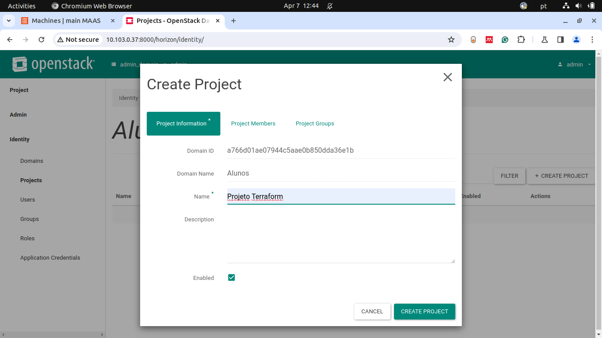

# SLA, DR e IaC

Objetivos

1. Entender os conceitos básicos Infraestrutura como código.
1. Entender os conceitos básicos sobre SLA e DR.

Pré-requisitos:

Terminar o capítulo anterior (Openstack)
Realizar a leitura [Kavis - Cap 11 e Cap 13]


??? info 
    **DIVISÃO DO ROTEIRO** 
    O Roteiro é dividido em 2 partes principais.

      * Entendendo IaC - Visão Geral
      * Criando hierarquia de projetos
      * Criando a Infraestrutura utilizando IaC
      * Subindo aplicação separada por aluno

## IaC Visão geral

Infraestrutura como código (IaC) é o gerenciamento e provisionamento de infraestrutura por meio de código, em vez de processos manuais.

Utilizando o IaC, é possível criar arquivos de configuração que contenham especificações de infraestrutura, o que facilita a edição e distribuição das configurações. Também garante que você sempre forneça o mesmo ambiente. Ao codificar e documentar suas especificações de configuração, o IaC auxilia no gerenciamento de configuração e ajuda a evitar alterações de configuração não documentadas. O IaC evoluiu para lidar com a deriva ambiental em dutos de liberação. Sem o IaC, as equipes teriam que manter as configurações do ambiente de implantação separadamente. Com o tempo, cada ambiente se torna um "floco de neve", uma configuração única que não pode ser replicada automaticamente. Inconsistências entre ambientes podem causar problemas de implantação. O gerenciamento e a manutenção da infraestrutura envolvem processos manuais que são propensos a erros e difíceis de rastrear.


{width=600}

### Reforçando

O IaC evita a configuração manual e garante consistência ao expressar o estado desejado do ambiente por meio de código bem documentado em formatos como por exemplo o JSON. A implantação de infraestrutura com IaC é repetível e evita problemas de tempo de execução causados ​​por configurações quebradas ou dependências ausentes. 

**Para fazer alterações, você precisa editar a origem, não o destino**.

A idempotência (a capacidade de uma determinada operação produzir sempre o mesmo resultado) é um princípio fundamental da IaC. O comando deploy sempre define o ambiente de destino com a mesma configuração, independentemente do estado inicial do ambiente. A idempotência é alcançada configurando automaticamente os destinos existentes ou excluindo os destinos existentes e recriando novos ambientes.

### O que é Terraform em Infraestrutura como Código?

É uma das possiveis ferramentas para IaC.

O mercado de Infraestrutura como Código amadureceu ao longo dos anos. Há uma grande variedade de ferramentas, oferecendo diferentes recursos.

{width=600}

Terraform é a infraestrutura da HashiCorp como ferramenta de código. Ele permite que você defina recursos e infraestrutura em arquivos de configuração declarativos legíveis por humanos e gerencie o ciclo de vida de sua infraestrutura. O uso do Terraform tem várias vantagens em relação ao gerenciamento manual de sua infraestrutura:

1. O Terraform pode gerenciar a infraestrutura em várias plataformas de nuvem.
1. A linguagem de configuração legível por humanos ajuda você a escrever código de infraestrutura rapidamente.
1. O estado do Terraform permite rastrear alterações de recursos em todas as suas implantações.
1. Você pode confirmar suas configurações no controle de versão para colaborar com segurança na infraestrutura.


:zap: Para implantar infraestrutura com o Terraform:

    * Scope         - Identifique a infraestrutura para o seu projeto.
    * Author        - Escreva a configuração para sua infraestrutura.
    * Initialize    - Instale os plugins que o Terraform precisa para gerenciar a infraestrutura.
    * Plan          - Visualize as alterações que o Terraform fará para corresponder à sua configuração.
    * Apply         - Faça as alterações planejadas.


### Instalar Terraform

=== "Ubuntu/Debian"

    * `wget -O- https://apt.releases.hashicorp.com/gpg | gpg --dearmor | sudo tee /usr/share/keyrings/hashicorp-archive-keyring.gpg`
    * `gpg --no-default-keyring --keyring /usr/share/keyrings/hashicorp-archive-keyring.gpg --fingerprint`
    * `echo "deb [signed-by=/usr/share/keyrings/hashicorp-archive-keyring.gpg] https://apt.releases.hashicorp.com $(lsb_release -cs) main" | sudo tee /etc/apt/sources.list.d/hashicorp.list`
    * `sudo apt update && sudo apt install terraform`

=== "CentOS/RHEL"

    * `sudo yum install -y yum-utils`
    * `sudo yum-config-manager --add-repo https://rpm.releases.hashicorp.com/RHEL/hashicorp.repo`
    * `sudo yum -y install terraform`

=== "Windows/FreeBSD/OpenBSD/Solaris"

    * `Ir na pagina oficial e baixar o pacote binário`
    * `https://www.terraform.io/downloads`

=== "macOS"

    * `brew tap hashicorp/tap`
    * `brew install hashicorp/tap/terraform`


## Entendendo a estrutura de gestão de projetos Openstack

O OpenStack, uma plataforma de nuvem de código aberto, fornece uma infraestrutura flexível como serviço (IaaS) para grandes e pequenas organizações. A Canonical oferece um ecossistema para implementar e gerenciar o OpenStack através de ferramentas como MAAS (Metal as a Service), que gerencia o hardware físico; JUJU, que orquestra os serviços; e o próprio OpenStack, que gerencia os recursos de computação, armazenamento e rede na nuvem. Dentro do OpenStack, especialmente na aba de Identity (conhecida como Keystone), você encontra vários conceitos fundamentais: Domains, Projects, Users, Groups, e Roles. Vamos detalhar cada um:

1. Domains

    Um Domain no OpenStack é a unidade de alta hierarquia para organizar e isolar os recursos e usuários. Ele é usado para agrupar projetos e usuários, permitindo uma gestão mais fácil em ambientes com múltiplas organizações ou departamentos distintos. Em outras palavras, um domínio pode ser considerado como uma organização ou um tenant de mais alto nível.

1. Projects

    Um Project (anteriormente conhecido como "tenant") é uma unidade que agrupa e isola recursos dentro do OpenStack. Projetos são utilizados para organizar usuários, instâncias de máquinas virtuais, redes, e outros recursos de nuvem, facilitando a gestão de custos, segurança e quota de recursos. Os projetos podem ser entendidos como departamentos ou times dentro de uma organização, cada um com seus recursos alocados.

1. Users

    Um User é uma conta que representa uma pessoa, sistema ou serviço que utiliza ou gerencia os recursos na nuvem do OpenStack. Usuários podem ter acesso a um ou mais projetos e podem ter diferentes permissões em cada um, dependendo dos roles (funções) que lhes são atribuídos.

1. Groups

    Um Group é uma coleção de usuários. Grupos facilitam a gestão de políticas e permissões para um conjunto de usuários, permitindo que administradores apliquem regras de acesso e permissões a muitos usuários simultaneamente, em vez de configurar cada usuário individualmente.

1. Roles

    Um Role (função) define as permissões de acesso que um usuário ou grupo tem sobre os recursos e operações dentro do OpenStack. Roles determinam o que um usuário pode ou não fazer. Por exemplo, um usuário com o role de "admin" em um projeto pode criar e gerenciar instâncias de máquinas virtuais, redes e volumes de armazenamento, enquanto um usuário com um role mais restrito pode apenas visualizar esses recursos.


Esses conceitos trabalham juntos dentro do Keystone para fornecer um sistema de gerenciamento de identidade e acesso (IAM) robusto, flexível e escalável para projetos de nuvem OpenStack, permitindo uma administração eficaz dos recursos de nuvem em ambientes complexos e multi-tenant.


## Criando a hierarquia de projetos separado por aluno
  
**Agora vamos ver como isso funciona. Até agora você acessou o dashboard ou utilizou a interface de linha de comando (CLI) para criar rede, subrede, instancia, roteador e outros recursos. Iremos criar isso via cógigo**

**Para não confundir os recursos de cada usuário, como por exemplo na topologia abaixo, iremos criar uma separação lógica destes usuários, assim como** ^^deveria^^ **acontecer em nuvem**


{width=600}

Criar um domínio, dois projetos e um usuário "Aluno" em cada projeto no OpenStack via Horizon Dashboard (a interface web do OpenStack), siga os passos abaixo. Este processo pode variar ligeiramente dependendo da versão do OpenStack que você está utilizando, mas em geral, os passos devem ser bastante similares.


### Criar um unico **Domain**


* Criar um Domínio
  Navegue até Identity > Domains.
  Clique em Create Domain.
  Forneça o nome para o domínio (AlunosDomain) e uma descrição opcional.
  Clique em Create Domain para finalizar a criação.

{width=600}


2. Defina o Domain criado com o novo Contexto de uso

{width=600}


### Criar um projeto para cada Aluno.

* Criar Projeto
  Navegue até Identity > Projects.
  Clique em Create Project.
  Forneça o nome para o projeto que deve seguir o **padrão** --> ( Kit  +  letra do kit + nome_do _aluno).
  Adicione uma descrição opcional para o projeto.
  Configure qualquer quota que você deseje para o projeto.
  Clique em Create Project para concluir.
  Crie o proximo project, aluno2

{width=600}

* Criar Usuários
  Navegue até Identity > Users.
  Clique em Create User.
  Forneça o nome do usuário (por exemplo, aluno1), e-mail, descrição, e uma senha inicial.
  Selecione o domínio (que voces acabaram de criar).
  Selecione o projeto deste aluno para associar o usuário a este projeto.
  Atribua-lhe os papéis administrativos.
  Repita este processo para o segundo usuário (aluno2).
  Clique em Create User para cada usuário para finalizar.

{width=600}

* Atribuir Papéis aos Usuários caso esquecido acima
  Após criar os usuários, você será capaz de atribuir papéis a eles dentro do projeto.
  Navegue até Identity > Projects e clique no projeto que você criou (AlunosProject).
  Vá até a aba Members.
  Clique em Manage Members.
  Adicione os usuários (aluno1 e aluno2) ao projeto e atribua-lhes os papéis administrativos.
  Clique em Save para aplicar as alterações.


## Criando a Infraestrutura utilizando IaC

O Terraform conta com arquivos .tf, que definem a infraestrutura. 

O Terraform sabe o que é implantado por meio do arquivo de estado. Este estado é armazenado por padrão em um arquivo local chamado “terraform.tfstate”. Também pode ser armazenado remotamente, o que funciona melhor em um ambiente de equipe. 

O Terraform permite vários provedores, normalmente inicializados em um arquivo chamado provider.tf.

A estrutura de pastas ficará conforme figura abaixo:


{width=600}

* Cada Aluno deve entrar no **MAIN** pela sua maquina e criar a estrutura :exclamation: :exclamation:

* Crie umapasta para você com o mesmo nome do projeto criado na etapa acima:

* Dentro desta pasta crie a pasta **terraform** e dentro dela crie os arquivos abaixo: (modifique o que for necessário)

provider.tf

```
# Terraform Openstack deployment
# Author: Tiago Demay - tiagoaodc@insper.edu.br


# Define required providers
terraform {
required_version = ">= 0.14.0"
  required_providers {
    openstack = {
      source  = "terraform-provider-openstack/openstack"
      version = "~> 1.35.0"
    }
  }
}


# Configure the OpenStack Provider

provider "openstack" {
  region              = "RegionOne"
  user_name           = "SEU_USUARIO"
}


```

instance1.tf
```
resource "openstack_compute_instance_v2" "instancia" {
  name            = "basic"
  image_name      = "bionic-amd64"
  flavor_name     = "m1.small"
  key_pair        = "mykey"
  security_groups = ["default"]

  network {
    name = "network_1"
  }

  depends_on = [openstack_networking_network_v2.network_1]

}

```

instance2.tf
```
resource "openstack_compute_instance_v2" "instancia" {
  name            = "basic2"
  image_name      = "jammy-amd64"
  flavor_name     = "m1.tiny"
  key_pair        = "mykey"
  security_groups = ["default"]

  network {
    name = "network_1"
  }

  depends_on = [openstack_networking_network_v2.network_1]

}

```
!!! info
    observação amiga: a sua rede e do seu amigo não podem ter o mesmo nome! Então uma delas pode ser chamada de network_1 e outra network_2 por exemplo! (lembre de mudar em todos arquivos que a utilizam).
    
network.tf
```
resource "openstack_networking_network_v2" "network_1" {
  name           = "network_1"
  admin_state_up = "true"
}

resource "openstack_networking_subnet_v2" "subnet_1" {
  network_id = "${openstack_networking_network_v2.network_1.id}"
  cidr       = "192.167.199.0/24"
}

```

!!! info
    Alterar a variavel external_network_id = <"ID_EXT_NETWORK"> para o ID da sua rede externa, você pode encontrar esta informacão, acessando o Dashboard do Openstack ou via CLI openstack


router.tf
```
resource "openstack_networking_router_v2" "router_1" {
  name                = "my_router"
  admin_state_up      = true
  external_network_id = <"ID_EXT_NETWORK">
}

resource "openstack_networking_router_interface_v2" "int_1" {
  router_id = "${openstack_networking_router_v2.router_1.id}"
  subnet_id = "${openstack_networking_subnet_v2.subnet_1.id}"
}


```

### Credenciais do seu usuário

1. Entre no dashboard com o login do seu usuario (cada aluno terá o seu);
2. Na aba project --> API access, faça o download do openstack rc file do seu usuário;
3. Copie o conteudo para a sua pasta de projeto (Obs: o arquivo será baixado noseu notebook pessoal, passe o conteudo para o servidor Main)
4. De a permissão de execução para o arquivo `chmod +x arquivo.sh`
5. Carregue as variaveis de ambiente do seu usuário `source arquivo.sh`


!!! Dica

    Caso aconteça o erro abaixo:
    ```
    Attempting to parse version from URL.

    SSL exception connecting to https://172.16.0.x:5000/v3/auth/tokens: HTTPSConnectionPool(host='172.16.0.x', port=5000): 
    
    Max retries exceeded with url: /v3/auth/tokens (Caused by SSLError(SSLCertVerificationError
    
    (1, '[SSL: CERTIFICATE_VERIFY_FAILED] certificate verify failed: unable to get local issuer certificate (_ssl.c:1131)')))
    ```

    O erro que você está enfrentando está relacionado à verificação do certificado SSL ao tentar se conectar ao endpoint do OpenStack. O erro [SSL: CERTIFICATE_VERIFY_FAILED] certificate verify failed: unable to get local issuer certificate sugere que o cliente (neste caso, possivelmente um cliente OpenStack CLI, uma SDK ou um script personalizado que usa a API OpenStack) não conseguiu verificar o certificado SSL do servidor devido à ausência do certificado da autoridade certificadora (CA) correspondente no armazenamento local de certificados confiáveis.

    Aqui estão algumas maneiras de contornar ou resolver esse problema, basta utilizar uma delas:

    * Colocar suas credenciais depois das credenciais do admin, isso modifica somente o necessário nas ENVs do ambiente
    
    ```
    source openstack-base/openrc
    source arquivo.sh
    ```

    * Desabilitar a Verificação de SSL (Não Recomendado para Produção)

    `export OS_VERIFY=False` ou dar o comando com a flag `--insecure`
    
    * Indicar o caminho correto do certificado
    
    `export OS_CACERT=/caminho/para/o/certificado.pem`
    


Para fazer a implementação da infraestrutura, execute os comandos abaixo:

`terraform plan`

* Este comando é utilizado para criar um plano de execução. Ele mostra quais ações o Terraform executará quando você aplicar suas configurações. 

`terraform apply`

* O comando `terraform apply` aplica as mudanças necessárias para alcançar o estado desejado da sua configuração. Ele cria, atualiza ou destrói os recursos conforme necessário.

Utlize a CLI do openstack para verificar que a instancia foi criada.


!!! exercise
    CheckPoint-Por_aluno


    1. De um print das Telas abaixo:
      1. Da aba Identy *projects* no **OpenStack**.
      2. Da aba Identy *users* no **OpenStack**.
      2. Da aba compute *overview* no **OpenStack**.
      3. Da aba compute *instances* no **OpenStack**.
      4. Da aba network *topology* no **OpenStack**.


## Criando a sua aplicação em cada Projeto <strong>(individual por aluno)</strong>


### Requisitos de Projeto: Instalação do Mattermost(slack opensource) em Duas Máquinas Virtuais

### 1. Configuração das Máquinas Virtuais
- **Máquina 1 (Aplicação Mattermost)**:
  - Sistema operacional: Ubuntu 20.04 LTS ou similar.
  - Instalação do Mattermost conforme a documentação oficial.
    - https://mattermost.com/download/?utm_source=github-mattermost-server-readme
  - Configuração para que a aplicação Mattermost se comunique com o banco de dados na outra máquina.
  
- **Máquina 2 (Banco de Dados)**:
  - Sistema operacional: Ubuntu 20.04 LTS ou similar.
  - Instalação do banco de dados PostgreSQL.
  - Configuração adequada das permissões e criação do banco de dados para uso pelo Mattermost.

### 2. Comunicação entre as Máquinas
- Configuração de rede entre as duas VMs (utilizando endereços IP internos).
- Firewall e regras de segurança configuradas para permitir a comunicação entre a aplicação e o banco de dados nas portas corretas (ex: porta 8065 para o Mattermost e porta 5432 para PostgreSQL, ou 27017 para MongoDB). 
- Não deixar portas abertas sem necessidade.

### 3. Configuração do Mattermost
- Configuração do `config.json` do Mattermost para conectar-se corretamente ao banco de dados na segunda máquina.
- Configuração de um serviço systemd para garantir que o Mattermost inicie automaticamente com a máquina.
- Customização da interface inicial do Mattermost (opcional).

### 4. Testes e Verificação
- Verificar se o Mattermost está rodando corretamente ao acessá-lo pelo navegador.
- Criar uma conta de administrador e fazer login.
- Testar a criação de canais de mensagens e a funcionalidade básica de chat.

### 5. Documentação
- Especificar todos os passos realizados para configurar a infraestrutura e solucionar possíveis problemas encontrados.
- Explicação sobre como foi configurada a comunicação entre as máquinas virtuais e como o banco de dados foi configurado.

!!! exercise
    CheckPoint-Por_aluno


    1. De um print das Telas abaixo:
      1. Da aba Network *Security Groups* no **OpenStack**.
      2. Dos arquivos de configuracao 
        - config.json
        - /etc/postgresql/{version}/main/pg_hba.conf
        - /etc/postgresql/{version}/main/postgresql.conf
        - /opt/mattermost
      3. Do dashboard do Mattermost 
      4. Da tela de mensageria com o canal criado no passo 4  


### Depois de ter certeza de que fez tudo é só deletar
Para deletar os recursos, execute o comando:

`terraform destroy`

## Criando um plano de Disaster Recovery e SLA (QUESTOES)

### **Pode ser no Word!!!**

!!! exercise
    QUESTOES

    1. Você é o CTO (Chief Technology Officer) de uma grande empresa com sede em várias capitais no Brasil e precisa implantar um sistema crítico, de baixo custo e com dados sigilosos para a área operacional. 
        1. Você escolheria Public Cloud ou Private Cloud?
        1. Agora explique para ao RH por que você precisa de um time de DevOps.
        1. Considerando o mesmo sistema crítico, agora sua equipe deverá planejar e implementar um ambiente resiliente e capaz de mitigar possíveis interrupções/indisponibilidades. Para isso, identifiquem quais são as principais ameaças que podem colocar sua infraestrutura em risco, e descreva as principais ações que possibilitem o restabelecimento de todas as aplicações de forma rápida e organizada caso algum evento cause uma interrupção ou incidente de segurança. Para isso monte um plano de DR e HA que considere entre as ações:
            - Mapeamento das principais ameaças que podem colocar em riscos o seu ambiente.
            - Elenque e priorize as ações para a recuperação de seu ambiente em uma possível interrupção/desastre.
            - Como sua equipe irá tratar a política de backup?
            - Considerando possíveis instabilidades e problemas, descreva como alta disponibilidade será implementada em sua infraestrutura.